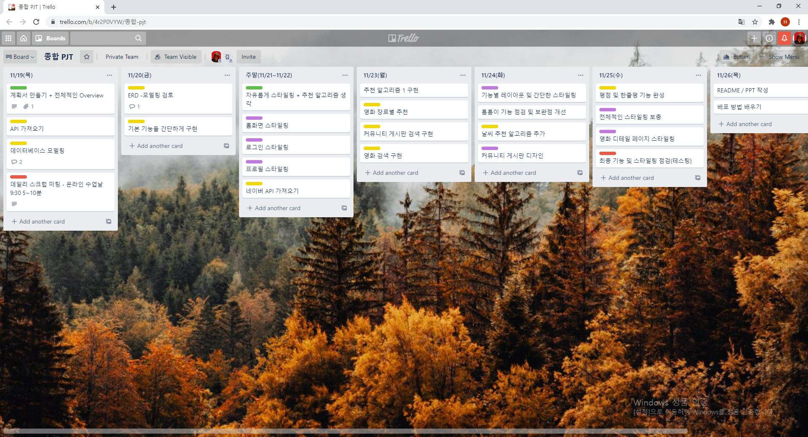
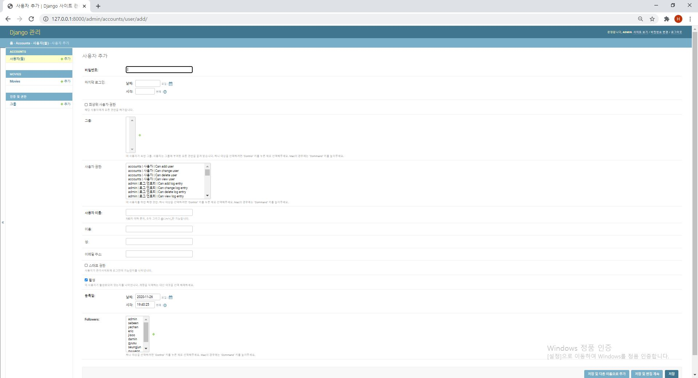
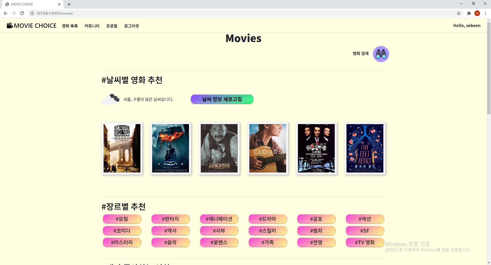
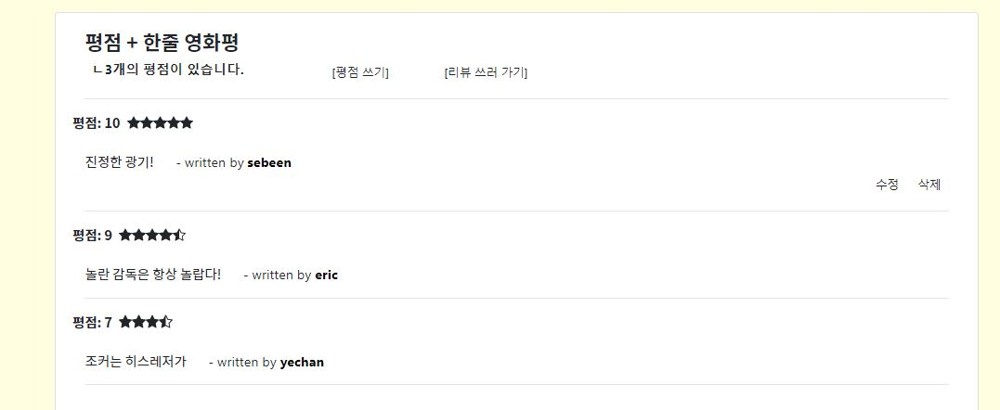

# MOVIE CHOICE

 [](https://shields.io/) [](https://shields.io/) [ ](https://GitHub.com/Naereen/StrapDown.js/releases/)


## 1. 프로젝트 소개

> SSAFY 4기 1학기 종합 PJT
>
> MOVIE CHOICE 프로젝트를 소개합니다!


### 1) 서비스 소개

- 약 1000개의 영화 데이터를 가지고 사용자에게 영화를 추천하거나 사용자가 영화 정보를 검색할 수 있습니다.
- 커뮤니티가 있어 각 영화에 대해 리뷰를 쓸 수 있고 댓글로 소통, 유저간의 팔로우 등을 할 수 있습니다.


### 2) 팀원 정보

|  팀원  |                          업무 분담                           |
| :----: | :----------------------------------------------------------: |
| 이세빈 |     Django 모델링, API 데이터 수집 및 DB 관리, 기능 구현     |
| 김예찬 | Trello 일정 관리, Django 모델링, 기능 구현 및 CSS & Bootstrap |


### 3) 프로젝트 기간 및 일정

- 2020.11.19 ~ 2020.11.26




### 4) 목표 서비스 구현 및 실제 구현 정도

- 목표로 하던 서비스인 영화 추천, 영화 검색, 커뮤니티 기능 등 필요한 모든 기능을 구현했습니다.
- 프로젝트 구현의 아쉬웠던 부분은 아래의 문제점 및 해결방법에 서술하겠습니다.


### 5) 개발환경

- 프레임워크로 `Djnago` 를 이용하고 경우에 따라 `Ajax` 를 활용한 비동기 요청을 합니다.


#### (1) 언어

- Python 3.7+
- Django 3.X


#### (2) 도구

- vsCode
- Chrome Browser


#### (3) 아키텍처

- Django & Vanila JS


### 6) 프로젝트 구조

- final-project/은 startproject 명령어로 생성되는 project 디렉토리입니다.
- accounts/는 startapp 명령어로 생성되는 application 디렉토리입니다.
- movies/는 startapp 명령어로 생성되는 application 디렉토리입니다.
- community/는 startapp 명령어로 생성되는 application 디렉토리입니다.
- 아래의 폴더구조는 주요한 폴더와 파일만 명시되어 있습니다.

```
final_project/

	settings/

	static/

	templates/

		base.html

		home.html

	settings.py

	urls.py

	views.py

	wsgi.py

accounts/

	migrations/

	templates/

	forms.py

	models.py

	urls.py

	views.py

community/

	migrations/

	templates/

	forms.py

	models.py

	urls.py

	views.py

movies/

	migrations/

	templates/

	forms.py

	models.py

	urls.py

	views.py

manage.py

...
```


### 7) 데이터 베이스 모델 (ERD)

- 데이터베이스에서 모델의 ERD는 아래와 같습니다.


## 2. 프로젝트 기능

> 이번 프로젝트의 기능들을 설명합니다.

- 프로젝트의 기본적인 기능입니다.
- 자랑하고 싶거나 추가된 기능은 ❗❗로 구분하겠습니다.


### 1) final_project

- 첫 페이지로 나올 `Home.html` 과 `Navbar` 등 기본이 될 `base.html` 이 있습니다.


#### (1) 홈 화면

- 홈 화면에서 3개의 동영상들이 재생되고 있습니다.
- 해당 동영상들은 `django static` 을 이용해 넣었습니다.
- 네비게이션바가 고정되어 있어 화면을 내려도 나타납니다.
  - 로그인이 되어 있다면 네비게이션바 오른쪽에 `Hello, 유저이름` 이 나타납니다.
  - `유저이름` 을 클릭하면 해당 유저의 프로필 페이지로 이동할 수 있습니다.
- 홈 화면 맨 아래에 `footer` 가 나타납니다.
- 각 동영상 별로 버튼을 누르면 해당하는 기능으로 이동할 수 있습니다.

  - 로그인이 되어있어야 이동이 가능합니다.

    1. 영화 추천 페이지 이동

    2. 영화 검색 페이지 이동
    3. 커뮤니티 이동
- 로그인이 되어있지 않으면 로그인 페이지로 이동합니다.


### 2) Admin

- 관리자 권한으로 영화를 등록 / 수정 / 삭제 할 수 있습니다.
- 유저 관리할 수 있는 권한이 있습니다.
- `Django` 에서 기본으로 제공하는 `admin` 기능을 이용했습니다.


#### (1) admin 페이지


#### (2) 영화 관리 페이지


#### (3) 영화 생성


#### (4) 영화 수정 및 삭제


#### (5) 사용자 관리 페이지


#### (6) 사용자 생성




#### (7) 사용자 정보 수정 및 삭제


### 3) Accounts

- 회원 가입 및 로그인을 할 수 있습니다.
- 로그인이 되어 있지 않으면 `navbar` 에 회원가입, 로그인 이 나타납니다.
- 로그인이 되어 있으면 `navbar` 에 영화목록, 커뮤니티, 프로필, 로그아웃 이 나타납니다.
- `User` 모델은 `Django` 에서 제공하는 `AbstractUser` 을 이용했습니다.
- `followers` 라는 `ManyToMany` 필드로 유저간 서로 팔로우나 언팔로우를 할 수 있습니다.
- 팔로우 기능은 `axios` 를 이용해서 


#### ❗❗ (1) 회원 가입 페이지

- 기존에는 `form` 을 그대로 넘겨주는 방식을 이용했습니다.
- 하지만 `div` 로 `form tag` 를 감싸주고 `class` 를 줘서 보기 좋게 꾸몄습니다.
-  `script` 에서 `element` 를 뽑아내 해당 내용에 `placeholder` 를 줬습니다.

```html
<!-- accounts/signup.html -->


  <div style="width:100%; height:100%; background-image:URL(https://an2-img.amz.wtchn.net/image/v1/watcha/image/upload/v1600848003/z5bqlnc8yqsakgm4wjmo.webp;">
    <div class="main-container">
      <div class="wrap">
        <div class="main-wrap nt-0">
          <h1 class="display-4 font01 mb-5">회원가입</h1>
          <form action="" method="POST">
            
            <div class="font02">
              {{ form.as_p }}
            </div>
            <li class="font02" style="color: black;">다른 개인 정보와 유사한 비밀번호는 사용할 수 없습니다.</li>
            <li class="font02" style="color: black;">비밀번호는 최소 8자 이상이어야 합니다.</li>
            <li class="font02" style="color: black;">통상적으로 자주 사용되는 비밀번호는 사용할 수 없습니다.</li>
            <li class="font02" style="color: black;">숫자로만 이루어진 비밀번호는 사용할 수 없습니다.</li>
            <br>
            <div class="d-flex column justify-content-center">
              <input class="btn-block btn-lg btn-primary" type="submit">
            </div>
          </form>
        </div>
      </div>
    </div>
  </div>



  <script>
    document.getElementById('id_username').placeholder = '아이디';
    document.getElementById('id_password1').placeholder = '비밀번호';
    document.getElementById('id_password2').placeholder = '비밀번호 확인';
  </script>

```


#### (2) 로그인 페이지

- 회원가입과 동일한 방식을 이용했습니다.


#### ❗❗ (3) 프로필 페이지

- 유저의 활동 정보를 `card` 형태로 꾸몄습니다.
- 유저가 쓴 글, 좋아요한 글, 좋아요 한 영화 모두 각각의 내용을 클릭하면 해당 내용의 페이지로 이동할 수 있습니다.

```html
<!-- accounts/profile.html 일부 -->

...
    <div class="card-group">
      <div class="card card-primary text-center">
        
        <div class="card-body">
          <div class="badge badge-primary badge-sm">REVIEW</div>
          <div class="card-title"><h5 class="font03"><b>{{ person.username }}가 쓴 글</b></h5></div>
          
            <a href=""><p class="card-text text-left">{{ review.title }}</p></a>
            <hr>
          
        </div>
        <div class="card-footer">
        </div>
      </div>
...
```


#### (4) 다른  유저 팔로우 하기 전


#### (5) 다른 유저 팔로우 한 후


### 4) Movies

- 영화를 추천받고 검색할 수 있는 기능이 있습니다.
- 영화 디테일 페이지에서 영화의 정보와 해당 영화에 대한 평점을 줄 수 있습니다.


#### ❗❗ (1) `API` 데이터 수집

- `API` 데이터 수집의 경우에는 `API` 를 이용해 영화 정보와 날씨 정보를 가져옵니다.
  - TMDB, NAVER Open API, OpenWeatherMap 3가지의 API를 사용합니다.
  - TMDB에서 전반적인 영화 데이터를 받아오고, 필요하지만 없는 배우, 감독의 데이터를 네이버 API에서 가져옵니다.
  - `API KEY`는 공개되면 안되므로 `secrets.json` 파일을 만들어 넣어두고 관리합니다.
  - `settings.py` SECRET_KEY에 관한 내용을 정의합니다.
  - 이 프로젝트의 경우 저희가 쓰는 `API KEY` 4가지만 관리했습니다.

```python
# settings.py 일부

import os, json
from django.core.exceptions import ImproperlyConfigured

secret_file = os.path.join(BASE_DIR, 'secrets.json')

with open(secret_file) as f:
    secrets = json.loads(f.read())

def get_secret(setting, secrets=secrets):
    try:
        return secrets[setting]
    except KeyError:
        error_msg = "Set the {} environment variable".format(setting)
        raise ImproperlyConfigured(error_msg)

SECRET_KEY = 'o(%o210v*q2jbhut6i8*d2-!toytlif0so(*op(pg088qbsfmj'
TMDB_API_KEY = get_secret("TMDB_API_KEY")
NAVER_ID = get_secret("NAVER_ID")
NAVER_SECRET = get_secret("NAVER_SECRET")
WEATHER_API_KEY = get_secret("WEATHER_API_KEY")
```

- `API` 부분을 간략하게 설명하면
- TMDB에서 장르 데이터를 받아와 `genre` 에 넣는다.
- TMDB에서 불러운 `top_rated`  영화의 제목과 출시 날짜가 같은 NAVER API의 영화 데이터를 `movie` 에 넣는다.
- OpenWeatherMap에서 날씨 데이터를 가져와서 `weather` 에 넣는다.

```python
# movies/views.py 일부

def movie_api_url(request):
    TMDB_API_KEY = getattr(settings, 'TMDB_API_KEY', 'TMDB_API_KEY')
    NAVER_ID = getattr(settings, 'NAVER_ID', 'NAVER_ID')
    NAVER_SECRET = getattr(settings, 'NAVER_SECRET', 'NAVER_SECRET')
    WEATHER_API_KEY = getattr(settings, 'WEATHER_API_KEY', 'WEATHER_API_KEY')

    genre_api_url = f'https://api.themoviedb.org/3/genre/movie/list?api_key={TMDB_API_KEY}&language=ko-kr'
    genre_res = requests.get(genre_api_url).json()

    for i in range(len(genre_res['genres'])):
        genre = Genre()
        genre.id = genre_res['genres'][i]['id']
        genre.name = genre_res['genres'][i]['name']
        genre.save()
    
    movie_api_url = f'https://api.themoviedb.org/3/movie/top_rated?api_key={TMDB_API_KEY}&language=ko-kr&page='

    naver_api_url = 'https://openapi.naver.com/v1/search/movie?'
    
    header = {
        "X-Naver-Client-id" : NAVER_ID,
        "X-naver-Client-secret" : NAVER_SECRET
    }

    for i in range(1, 400):
        new_movie_api_url = movie_api_url + str(i)
        res = requests.get(new_movie_api_url).json()
        confirm = 0
        for j in range(len(res['results'])):
            movies = Movie.objects.all()
            movie = Movie()
            if not res['results'][j]['genre_ids']:
                confirm = 1
            
            new_naver_api_url = naver_api_url + f'&query={res["results"][j]["title"]}&yearfrom={str(res["results"][j]["release_date"])[0:4]}&yearto={str(res["results"][j]["release_date"])[0:4]}'
            naver_res = requests.get(new_naver_api_url, headers = header).json()
            naver_movie_items = naver_res.get('items')
            if not naver_movie_items:
                confirm = 1
            else:
                actor = ''
                director = ''
                for naver_movie in naver_movie_items:
                    if naver_movie['title'] == f'<b>{res["results"][j]["title"]}</b>':
                        actor = naver_movie['actor'][:len(naver_movie['actor'])-1]
                        director = naver_movie['director'][:len(naver_movie['director'])-1]
                if (not actor) or (not director):
                    confirm = 1
            
            for k in range(len(movies)):
                if str(movies[k]) == res['results'][j]['title']:
                    confirm = 1            

            if confirm == 0:
                movie.title = res['results'][j]['title']
                movie.release_date = res['results'][j]['release_date']
                movie.popularity = res['results'][j]['popularity']
                movie.vote_count = res['results'][j]['vote_count']
                movie.vote_average = res['results'][j]['vote_average']
                movie.overview = res['results'][j]['overview']
                movie.poster_path = 'https://image.tmdb.org/t/p/w500/' + res['results'][j]['poster_path']
                movie.actor = actor
                movie.director = director
                movie.save()
                for genre_id in res['results'][j]['genre_ids']:
                    movie.genres.add(get_object_or_404(Genre, id=genre_id))
                movie.save()
    
    weather_URL = f'http://api.openweathermap.org/data/2.5/weather?q=Seoul,kr&appid={WEATHER_API_KEY}&lang=kr'

    weather_res = requests.get(weather_URL)
    weather_data = json.loads(weather_res.text)

    weather = Weather.objects.all()
    if weather:
        weather.delete()

    weather = Weather()
    weather.id = weather_data['weather'][0]['id']
    weather_img_url = f'http://openweathermap.org/img/wn/{weather_data["weather"][0]["icon"]}@2x.png'
    weather.name = weather_img_url
    weather.save()

    return redirect('movies:index')
```


#### ❗❗ (2) 영화 목록 페이지

- 영화 목록 페이지에서는 추천한 영화들의 목록이 나타나 있습니다.

- 영화를 추천 받는 방식에는 다음과 같은 5가지가 있습니다.

##### <1> 날씨 정보에 따른 영화 추천

OpenWeatherMap에서 받아온 데이터중 아이콘의 숫자를 이용해 해당 아이콘이 의미하는 날씨에 어울리는 영화를 추천합니다

```python
# movies/views.py 일부

	weather = Weather.objects.all()[0]

    if weather.name[33:35] == '01':
        genre = get_object_or_404(Genre, id=10749)
        weather_text = '서울, 맑은 날씨입니다.'
    elif weather.name[33:35] == '02':
        genre = get_object_or_404(Genre, id=35)
        weather_text = '서울, 약간 구름이 있는 날씨입니다.'
    elif weather.name[33:35] == '03':
        genre = get_object_or_404(Genre, id=12)
        weather_text = '서울, 구름낀 날씨입니다.'
    elif weather.name[33:35] == '04':
        genre = get_object_or_404(Genre, id=18)
        weather_text = '서울, 구름이 많은 날씨입니다.'
    elif weather.name[33:35] == '09':
        genre = get_object_or_404(Genre, id=80)
        weather_text = '서울, 약간 비오는 날씨입니다.'
    elif weather.name[33:35] == '10':
        genre = get_object_or_404(Genre, id=53)
        weather_text = '서울, 비오는 날씨입니다.'
    elif weather.name[33:35] == '11':
        genre = get_object_or_404(Genre, id=27)
        weather_text = '서울, 천둥 번개치는 날씨입니다.'
    elif weather.name[33:35] == '13':
        genre = get_object_or_404(Genre, id=14)
        weather_text = '서울, 눈오는 날씨입니다.'
    elif weather.name[33:35] == '50':
        genre = get_object_or_404(Genre, id=9648)
        weather_text = '서울, 안개낀 날씨입니다.'
    
    weather_movies = genre.genre_movie.all()[:6]
```

##### <2> 장르별 영화 추천

장르와 영화의 `M:N 관계` 를 이용하여 장르에 따른 영화를 나타냅니다.

##### <3> 내가 좋아요한 영화 추천

내가 좋아요 누른 영화를 추천해줍니다.

##### <4> 내가 좋아요한 영화의 감독의 다른 영화 추천

내가 좋아요 누른 영화의 감독의 다른 영화를 추천해줍니다.

##### <5> 내가 좋아요한 영화의 장르의 다른 영화 추천

내가 좋아요 누른 영화의 다른 장르 영화를 추천해줍니다.

- 3, 4, 5 의 추천은 모두 중복이 안나도록 추천합니다.

```python
# movies/views.py 일부

	# 추천 알고리즘 1 - 좋아요 한 영화
    like_movie_list = []
    for like_movie in like_movies:
        like_movie_list.append(like_movie)

    # 추천 알고리즘 2 - 좋아요 한 영화의 감독의 다른 영화
    like_movie_director_movie_list = []
    for movie in movie_list:
        for like_movie in like_movies:
            if movie.director == like_movie.director:
                if movie not in like_movie_list:
                    if movie not in like_movie_director_movie_list:
                        like_movie_director_movie_list.append(movie)
    
    like_movie_genre_list = []
    for like_movie in like_movies:
        for like_movie_genre in like_movie.genres.all():
            like_movie_genre_list.append(like_movie_genre)
    
    # 추천 알고리즘 3 - 좋아요 한 영화의 장르의 다른 영화
    like_movie_genre_movie_list = []
    for like_movie_genre_movies in like_movie_genre_list:
        cnt = 0
        for like_movie_genre_movie in like_movie_genre_movies.genre_movie.all():
            if like_movie_genre_movie not in like_movie_list:
                if like_movie_genre_movie not in like_movie_director_movie_list:
                    if like_movie_genre_movie not in like_movie_genre_movie_list:
                        like_movie_genre_movie_list.append(like_movie_genre_movie)
            cnt += 1
            if cnt == 4:
                break
```

- 추천 받은 영화 카드에 커서가 올라가면 `hover` 로 색이 변합니다.




#### ❗❗ (3) 영화 검색 페이지

- 영화 검색은 전체, 제목, 배우, 감독, 줄거리 등 나눠서 검색할 수 있습니다.
  - 2글자 이상을 입력해야 검색할 수 있습니다.

```python
# movies/views.py 일부

def search_movie(request):
    movie_list = Movie.objects.all()
    
    search_keyword = request.GET.get('q', '')
    search_type = request.GET.get('type', '')

    search_movie_list = []
    if search_keyword :
        if len(search_keyword) >= 2 :
            if search_type == 'all':
                search_movie_list = movie_list.filter(Q (title__icontains=search_keyword) | Q (actor__icontains=search_keyword) | Q (overview__icontains=search_keyword))
            elif search_type == 'title':
                search_movie_list = movie_list.filter(title__icontains=search_keyword)
            elif search_type == 'actor':
                search_movie_list = movie_list.filter(actor__icontains=search_keyword)    
            elif search_type == 'director':
                search_movie_list = movie_list.filter(director__icontains=search_keyword)    
            elif search_type == 'overview':
                search_movie_list = movie_list.filter(overview__icontains=search_keyword)
                
    context = {
        'search_movie_list': search_movie_list,
    }
    return render(request, 'movies/search_movie_list.html', context)
```

```html
<!-- movies/search_movie_list.html 일부 -->

  <h1 class="text-center font01 mt-5">Search Movies</h1>
  <div class="mt-5 d-flex column justify-content-end mr-5 align-items-center">
    <form action="" method="GET">
      <div class="col">
        <div style="float: right;" class="form-row">
          <div class="form-row">
            <div class="col" style="margin-top: 10px;">
                <select style="width: 6em;" class="custom-select custom-select-md" name="type">
                    <option value="all">전체</option>
                    <option value="title">제목</option>
                    <option value="actor">배우</option>
                    <option value="director">감독</option>
                    <option value="overview">줄거리</option>
                </select>
            </div>
            <div class="col" style="margin-top: 10px;">
                <input type="text" name="q" value="{{ q }}" class="form-control form-control-md"
                    style="width: 15em;" placeholder="검색어를 입력해주세요.">
            </div>
            <div class="col">
              <button class="btn btn-md btn-primary mx-0 mt-2" type="submit" id="search_btn">검색</button>
            </div>
          </div>
        </div>
      </div>
    </form>
  </div>
```


- 드랍다운으로 검색 항목을 정할 수 있다.


- `다크` 를 검색했을 때 나오는 영화 목록입니다.


#### (4) 영화 디테일 페이지

- 영화 디테일 페이지에서 감독, 배우, 장르, 줄거리, 평점등의 정보를 얻을 수 있습니다.
- `axios` 를 이용해 좋아요를 클릭해도 페이지 새로고침 없이 반응이 가능합니다.
- 네이버 시리즈온에서 보기 를 클릭하면 해당 영화 제목을 검색한 네이버 시리즈온 페이지가 나타납니다.
- 평점 쓰기로 입력 받은 평점을 별과 한줄 평으로 나타냅니다.
- 평점 부분에서 자신이 쓴 평점은 수정, 삭제 글자가 나타나 해당 기능을 할 수 있습니다.


- 좋아요를 누른 후


- 평점 부분



- 네이버 시리즈온에서 보기 를 클릭했을 경우


#### ❗❗ (5) 영화 평점 입력 페이지

- 평점은 총 10점까지 줄 수 있으며 `PositiveSmallIntegerField` 를 이용하여 각 해당하는 평점의 가치를 나타낼 수 있습니다.
- 평점과 같은 갯수 만큼 별이 나타나도록 합니다. (10점이 별 5개이므로, 1점마다 별 반개의 의미를 갖고 있습니다.)
- 별은 `bootstrap icon` 를 이용했습니다.

```python
# movies/models.py 일부

RATE_CHOICE = [
    (1, '1 - Trash'),
    (2, '2 - Horrible'),
    (3, '3 - Terrible'),
    (4, '4 - Bad'),
    (5, '5 - OK'),
    (6, '6 - Watchable'),
    (7, '7 - Good'),
    (8, '8 - Very Good'),
    (9, '9 - Perfect'),
    (10, '10 - Master Piece'),
]


class Grade(models.Model):
    rate = models.PositiveSmallIntegerField(choices=RATE_CHOICE)
    content = models.CharField(max_length=50)
    created_at = models.DateTimeField(auto_now_add=True)
    updated_at = models.DateTimeField(auto_now=True)
    movie = models.ForeignKey(Movie, on_delete=models.CASCADE)
    user = models.ForeignKey(settings.AUTH_USER_MODEL, on_delete=models.CASCADE)
```


- 드랍다운으로 평점을 정할 수 있습니다.


- 평점이 8이므로 꽉 찬 별 8개가 나타납니다. 현재 `jisoo` 유저로 들어와 자신의 평점에 수정, 삭제 글자가 나타났습니다.


#### (6) 영화 평점 수정 페이지

- 영화 평점 입력 페이지와 같은 동작을 합니다.
- 다른 점이 있다면 입력 받는 폼에 이전의 값들이 들어가 있습니다.
- 평점 입력 페이지는 `평점 주기` 버튼이고 평점 수정 페이지는 `수정 완료` 버튼입니다.


- 평점을 10으로 수정해 별이 5개 나타나고, 한 줄평에 대박! 을 추가한 문장이 나타납니다.


### 5) Community

- 리뷰를 쓰고 수정할 수 있는 페이지입니다.
- 리뷰에는 댓글을 쓰거나 좋아요를 할 수 있습니다.


#### ❗❗ (1) 커뮤니티 페이지

- `table` 과 검색 기능을 적절히 사용하여 게시판 같은 느낌의 커뮤니티 페이지를 만들었습니다.

- 영화 검색 페이지의 검색 기능과 마찬가지로 커뮤니티 페이지도 리뷰 정보에 관해 검색할 수 있습니다.
- `airbnb style pagination` 을 이용하여 10개의 리뷰씩 한 페이지에 보이도록 지정했습니다.

```html
<!-- community/index.html 일부 -->

  <table class="table table-sm table-hover">
    <thead style="border-top: 1px solid #dee2e6;">
      <tr class="text-center">
        <th style="font-weight: bold; font-size: 16px;">번호</th>
        <th style="font-weight: bold; font-size: 16px;">제목</th>
        <th style="font-weight: bold; font-size: 16px;">영화 제목</th>
        <th style="font-weight: bold; font-size: 16px;">작성자</th>
        <th style="font-weight: bold; font-size: 16px;">등록일</th>
        <th style="font-weight: bold; font-size: 16px;">좋아요 수</th>
      </tr>
    </thead>
    <tbody>
      
        <tr class="text-center" style="cursor:pointer;" onclick="location.href=''">
          <td style="font-weight: 500;">{{ review.pk }}</td>
          <td class="text-center" style="width:30%; font-weight: 600;"><a id="notice-{{ notice.id }}">{{ review.title|truncatechars:30 }}</a></td>
          <td style="width:20%; font-weight: 600;">{{ review.movie|truncatechars:20 }}</td>
          <td style="font-weight: 500;"><a href="">{{ review.user }}</a></td>
          <td style="font-weight: 500;">{{ review.created_at|date:'Y. m. d' }}</td>
          <td style="font-weight: 500;">{{ review.like_users.all|length }}</td>
      </tr>
    
  </tbody>
</table>
```

```python
# community/views.py 일부

    # pagination
    total_len = len(reviews)
    paginator = Paginator(reviews, 10)
    page = request.GET.get('page', 1)
    
    try:
        users = paginator.page(page)
    except PageNotAnInteger:
        users = paginator.page(1)
    except EmptyPage:
        users = paginator.page(paginator.num_pages)

    index = users.number - 1
    max_index = len(paginator.page_range)
    if index == 2:
        start_index = index - 2
    elif index == 3:
        start_index = index - 3
    elif index == max_index - 1:
        start_index = max_index - 3
    elif index >= 1:
        start_index = index - 1
    else:
        start_index = 0
    
    if index < 1:
        end_index = 3 - start_index
    else:
        if index < max_index - 4:
            end_index = index + 2
        else:
            end_index = max_index
    page_range = list(paginator.page_range[start_index:end_index])
```


- 검색 기능


- 전설이라는 키워드를 갖는 것들이 최신 글 순으로 나타난다.


#### (2) 리뷰 디테일 페이지

- 자신이 작성한 리뷰만 수정하거나 삭제할 수 있습니다.
- 댓글을 달 수 있고 자신이 단 댓글만 삭제할 수 있습니다.
- 마음에 드는 리뷰에 좋아요를 누를 수 있고 `axios` 를 이용하여 새로고침없이 좋아요 기능이 작동합니다.
- 현재 `sebeen` 유저로 본인이 쓴 리뷰를 들어가 리뷰와 댓글 사이 수정 삭제 글자가 보입니다.


- `jisoo` 계정으로 들어오면 수정 삭제 글자가 없어지고 자신은 좋아요를 이미 누른 상태이므로 빨간 하트가 나옵니다.
- 자신이 단 댓글에는 생성 시각 옆에 `DELETE` 버튼이 생성됩니다.


- 댓글을 작성할 수 있습니다.


- `DELETE` 버튼을 누르면 삭제됩니다.


#### (3) 리뷰 생성 페이지

- 리뷰 제목과 영화 제목, 자신이 정하는 평점, 리뷰 내용등을 입력할 수 있습니다.


#### (4) 리뷰 수정 페이지

- 리뷰를 수정할 수 있습니다.
- 리뷰 생성 페이지와의 차이점은 이전에 써진 내용이 적혀 있고 오른쪽 아래 작성하기 에서 수정완료 로 변경됐습니다.


- 가장 마지막에 생성된 리뷰라 마지막 4페이지에 있습니다.


- 작성자 본인이 삭제를 눌러 4페이에 있던 리뷰가 사라지고 3페이지까지만 나타납니다.


### 6) 배포

- 배포를 하기 위해서 프로젝트 파일 아래에 settings 폴더를 만듭니다.
- settings 폴더 아래에 `__init__` , `base.py` , `local.py` , `production.py` 를 생성합니다.
  - `base.py` 는 `settings.py` 역할을 합니다.
  - `local.py` 은 개발자용으로 `DEBUG` 를 `True` 로 합니다.
  - `production.py` 는 사용자용으로 `DEBUG` 를 `False` 로 합니다.
- 배포에 관한 자세한 사항은 아직 정확하게 이해하지 못해 교수님께서 첨부해주신 markdow 파일로 대체하겠습니다.
  - 프로젝트 내 `deployment` 폴더 참조
- 저희의 배포 `URL` 입니다.

- [http://3.34.131.205/](http://3.34.131.205/)


## 3. 프로젝트 설정 및 실행 방법

> 프로젝트를 실행하기 위한 설정 및 실행 방법입니다.


### 1) Python

- 이 프로젝트는 `Django` 를 이용하므로 `Python 3.7+` 버전을 사용합니다.
- 아래의 명령어로 버전을 확인하세요.

```bash
$ python -V
```


### 2) 가상환경

- 이 프로젝트는 가상환경을 설정해서 진행했습니다.
- 가상환경을 설정해서 실행하시길 바랍니다.

```bash
# 1. 가상환경 만들기
$ python -m venv (가상환경이름)

# 2. 가상환경 활성화
# Window와 Mac 사용자간 차이가 있으므로 자신의 OS에 맞는 설정을 하세요.

# 2-1. Window
$ source (가상환경이름)/Scripts/activate

# 2-2. Mac
$ source (가상환경이름)/bin/activate

# 3. 가상환경 비활성화
$ deactivate
```


### 3) Django

- 프로젝트의 프레임워크인 `Django` 를 설치합니다.
- 해당 프로젝트는 `Django 3.X` 를 이용합니다.

```bash
$ pip install django
```


### 4) Django-seed

- `community` 의 `review` 에 `dummy data` 를 넣어주려면 `django-seed` 를 이용하세요.
- 꼭 `settings.py`의 `django_seed` app을 추가해야 합니다.

```bash
$ pip install django-seed
```

```python
# settings.py

INSTALLED_APPS = [
    ...
    
    'django_seed',
    
    ...
]
```

```bash
# 만약 20개의 data를 넣어준다면

$ python manage.py seed community --number=20
```


### 5) requests

- `API` 통신을 하기위해 `requests` 를 설치합니다.

```bash
$ pip install requests
```


### 6) requirements.txt

- `Python` 과 가상환경을 제외한 모든 설치 항목들이 작성된 `requirements.txt` 를 이용해 설치합니다.

```bash
$ pip install -r requirements.txt
```


### 7) secrets.json

- `API KEY` 들을 담아둘 `secrets.json` 파일을 만들어서 `manage.py` 와 같은 위치에 둡니다.

```json
{
    "TMDB_API_KEY": "본인이 발급받은 키를 입력하세요.",
    "NAVER_ID": "본인이 발급받은 키를 입력하세요.",
    "NAVER_SECRET": "본인이 발급받은 키를 입력하세요.",
    "WEATHER_API_KEY": "본인이 발급받은 키를 입력하세요."
}
```


## 4. 문제점 및 해결 방법

> 문제점이라기 보다는 프로젝트를 진행하면서 아쉬웠던 부분들을 정리하고 이에 대한 해결 방법입니다.


### 1) 프로필 사진 넣기

- 회원가입을 할 때, 사진을 입력받아 프로필 사진을 넣고 싶었습니다.
- 그래서 `User` 모델을 정의할 때, 팔로우를 넣은 것처럼 `image` 라는 필드를 주고 했습니다.
- 회원가입할 때, 파일 첨부 부분이 생겨 성공한 줄 알았지만 `DB` 에 보니 들어낸 내용 자체가 없었습니다.
- 그래서 구글링한 결과, 프로필 사진을 넣으려면 `User` 모델과 `Profile` 이라는 모델을 `1:1 대응` 시키면 된다는 사실을 알았습니다.
- 이를 적용하려고 했는데 이미지를 넣기 위해선 `Django MEDIA` 의 경로등 `MEDIA` 에 대한 이해가 필요했고, 배우긴 했지만 너무 오래되고 딱 하루 `STATIC` 을 배우면서 넘어간 부분이라 해결하기 어려웠습니다.
- `MEDIA` 의 개념을 이해하고 파일 업로드 하는 것과 `1:1 대응` 의 `Profile` 모델을 사용하면 충분히 해결할 수 있는 문제일 것입니다.


### 2) 별점 위젯

- 별점 위젯을 이용하면 더욱 화려하게 별점을 만들 수 있습니다.
- 현재도 평점을 입력할때, 평점의 입력값에 따라 별점이 나타납니다.
- 이는 `bootstrap icon` 을 이용했습니다.
- 하지만 코드를 보면 아시겠지만, 평점이 1 일때, 2 일때 등의 경우를 모두 넣어주고 `bootstrap icon` 코드까지 넣으니 `html` 파일이 매우 길어지는 문제가 발생했습니다.
- `Rating Widget` 을 이용한다면 이를 해결할 수 있을 것입니다.
- 또한 `javascript` 의 비동기 요청을 통해 사용자 경험을 향상 시킬 수 있을 것입니다.


### 3) 리뷰 쓸 때 영화 자동완성 기능

- 현재의 리뷰는 영화를 본인이 직접 입력하는 기능으로 구현되어있습니다.
- 하지만 원했던 기능은 글자를 입력하면 `DB` 에 저장된 영화가 아래에 자동완성으로 나타나는 것이었습니다.
- 해당 기능은 모델인 `Review` 와 `Movie` 사이의 `M:N 관계` 와 `jQuery` 의 `Autocomplete Widget` 을 사용하면 해결할 수 있을 것입니다.
- 처음에 `Review` 와 `Movie` 를 `M:N 관계` 로 설정했을 때는 해당 영화의 디테일에서 리뷰 쓰기 를 눌러 바로 리뷰 생성 폼이 나타나도록 구현했습니다.
- 이런 경우에 자동완성은 아니지만 원하는 결과처럼 영화와 연관된 리뷰를 만들 수 있었습니다.
- 하지만 커뮤니티 페이지를 만들고 페이지에서 리뷰를 생성하려하니 `Movie` 에 관련된 정보 없이 리뷰를 생성할 수 없었습니다.
- 그래서 `Movie` 와의 관계를 포기하고 `movie` 를 `CharFied` 로 줘 그냥 입력하도록 했습니다.
- `M:N 관계` 와 `jQuery` 에 대해 더 이해하고 공부한다면 문제를 해결할 수 있을 것입니다.


### 4) Vue 사용

- 처음 프로젝트를 시작할 때는 `Vue` 를 이용하고 싶었습니다.

- 하지만 `Vue` 는 `Django` 에 비해 공부한 시간도 적고 막판에 몰아서 배운 느낌이 들어 제대로 다루지 못할 것 같다는 느낌을 받았습니다.
- 그래서 이번 프로젝트는 `Django` 만을 이용하여 진행하게 됐습니다.
- `Django` 로도 충분히 어렵고 잘 되지만 `SPA` 처럼 사용자의 경험을 향상 시기는 데에는 부족함이 있던 것 같습니다. 물론 기존에 배운 좋아요, 팔로우 등은 `axios` 요청으로 새로고침 없이 만들 수 있었습니다.
- 2학기 때부터는 `Vue` 를 사용한 프로젝트가 있을 것이라고 하니 적극적으로 공부하면서 `Vue` 를 이해해야 겠습니다.


## 5. 느낀점

> 프로젝트를 진행하면서 느낀 점들 입니다.


### 1) 세빈

- 싸피의 1학기를 마무리하는 종합 프로젝트였습니다.
- 정말 관통 프로젝트라는 이름이 무서울 정도로 맨 처음 했던 `API` 부터 `Django` 프로젝트까지 꿰뚫는 프로젝트였습니다.
- 이 프로젝트를 하면서 매우 힘들고 제대로 작동하지 않으면 너무 화가 날 정도로 스트레스가 컸습니다.
- 만약 예찬이와 함께 하지 못했다면 중간에 다 포기하려고 했을 수도 있었던 것 같습니다.
- 특히 서로가 맡은 부분을 나눠서 하니 더 나은 기능으로 더 효율적인 작업을 할 수 있었던 것 같습니다.
- 2학기 때도 팀원들과 협업할 수 있도록 연습한 것 같아 프로젝트 자신감이 생겼습니다.
- 그리고 프로젝트를 통해 성장하는 제 자신을 발견했습니다.
- 전혀 못할 것 같던 `API` 통신도 TMDB, NAVER OPEN API, OpenWeatherMap 3개의 `API` 를 사용했습니다.
- 구현하기 애매할 것 같던 부분들도 새로운 방법을 이용해 구현하는 등 저 자신의 실력 향상에 놀랐습니다.
- 저에게 이런 교육의 기회를 주신 싸피에게 감사하고, 가르쳐 주신 이민교 교수님 그리고 함께 한 페어 예찬이에게 고마움을 전합니다.
- 2학기 때는 더 열심히 해서 훨씬 나은 프로젝트를 만들겠습니다!


### 2) 예찬

- 지난 4개월간의 코딩경험이 집합되는 프로젝트였다.
- 일주일이라는 시간이 너무 짧게 느껴질 정도로 웹 어플리케이션을 처음부터 끝까지 일주일안에 구현하는 것이 정말 쉽지만은 않았다.
- 코드를 통해 기능 하나 하나를 완성하고 스타일링이 완성될 때마다 희열 또는 짜증이 뒤섞인 애증의 감정들이 공존했지만, 프로젝트를 페어와 함께 완성해가는 것들이 귀중한 경험이었다.
- 앞으로 이 경험을 통해 더 발전한 프로젝트를 경험해보고 싶다.